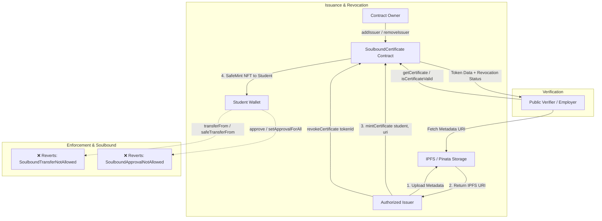

# On-Chain Verifiable Credentials (Soulbound Certificates)

A production-ready decentralized application (dApp) prototype for issuing, managing, and verifying **Soulbound (non-transferable) Certificates** on Ethereum / EVM blockchains.

Built for **HACKBLOX 2026 — Web3 Track (Problem Statement #2)**.

---

## Table of Contents

- [Overview](#overview)
- [Architecture](#architecture)
- [Smart Contract Specification](#smart-contract-specification)
  - [Soulbound Mechanism](#soulbound-mechanism)
  - [Issuer Authorization](#issuer-authorization)
  - [Minting](#minting)
  - [Revocation](#revocation)
  - [Public Verification](#public-verification)
- [Web3 Service Layer (For Frontend Developers)](#web3-service-layer-for-frontend-developers)
- [IPFS Metadata Architecture](#ipfs-metadata-architecture)
- [Frontend Testing Interface](#frontend-testing-interface)
- [Directory Structure](#directory-structure)
- [Installation & Setup](#installation--setup)
- [Running Automated Tests](#running-automated-tests)
- [End-to-End Validation Flow](#end-to-end-validation-flow)
- [Local Development Guide](#local-development-guide)
- [Sepolia Testnet Deployment Guide](#sepolia-testnet-deployment-guide)
- [Security Considerations](#security-considerations)
- [Known Limitations](#known-limitations)

---

## Overview

Traditional digital certificates and credentials suffer from forgery, revocation latency, and lack of universal verifiability. This project implements on-chain **Soulbound Tokens (SBTs)** based on ERC-721 where:
- Certificates are minted directly to the recipient's Ethereum wallet.
- Once minted, certificates are permanently tied to that wallet (**non-transferable**).
- Authorized institutional issuers can grant credentials and revoke them if invalidated, preserving the original issuance record on-chain.
- Anyone can publicly verify credential validity, ownership, issuer, and metadata instantly without intermediaries.

---

## Architecture



---

## Smart Contract Specification

The smart contract is implemented in `contracts/SoulboundCertificate.sol` using **Solidity ^0.8.28** and **OpenZeppelin Contracts v5.x**.

### Soulbound Mechanism
Soulbound behavior is enforced at the protocol layer by overriding OpenZeppelin ERC-721 hooks:
1. **Transfer Restriction (`_update`)**:
   ```solidity
   function _update(address to, uint256 tokenId, address auth) internal override returns (address) {
       address from = _ownerOf(tokenId);
       if (from != address(0) && to != address(0)) {
           revert SoulboundTransferNotAllowed();
       }
       if (from != address(0) && to == address(0)) {
           revert SoulboundTransferNotAllowed();
       }
       return super._update(to, tokenId, auth);
   }
   ```
   - Minting (`from == address(0)`) is permitted.
   - Any transfer between non-zero addresses reverts immediately with `SoulboundTransferNotAllowed()`.
   - Burning after minting is also blocked.
2. **Approval Restrictions (`approve` & `setApprovalForAll`)**:
   - Both functions are overridden to revert with `SoulboundApprovalNotAllowed()`, preventing marketplace listings and delegated transfer attempts.

### Issuer Authorization
- Controlled by contract owner (`Ownable`).
- `addIssuer(address issuer)`: Whitelists an institution/address. Emits `IssuerAuthorized`.
- `removeIssuer(address issuer)`: Revokes issuer rights. Emits `IssuerRemoved`.
- `isAuthorizedIssuer(address issuer)`: Public view method.

### Minting
- `mintCertificate(address student, string calldata metadataURI)`:
  - Caller must be an authorized issuer.
  - Requires non-zero student address and non-empty URI.
  - Mints the token to the student and stores certificate state.
  - Auto-increments token IDs starting at 1.
  - Emits `CertificateIssued(tokenId, student, issuer, metadataURI)`.

### Revocation
- `revokeCertificate(uint256 tokenId)`:
  - Caller must be the **original issuer** who minted the certificate.
  - Caller must still hold authorized issuer status.
  - Marks `revoked = true` without burning or transferring the token.
  - Emits `CertificateRevoked(tokenId, issuer)`.

### Public Verification
- `getCertificate(uint256 tokenId)`: Returns `(student, metadataURI, issuer, issuedAt, revoked)`.
- `isCertificateValid(uint256 tokenId)`: Returns `true` if token exists and is not revoked; returns `false` otherwise (without reverting for non-existent tokens).

---

## Web3 Service Layer (For Frontend Developers)

All Web3 and blockchain interaction logic is completely decoupled from UI components. Frontend developers can build or replace any UI framework by importing functions from `frontend/src/services`:

```typescript
import {
  // Provider / Wallet
  getBrowserProvider,
  getSigner,
  getReadOnlyContract,
  getSignedContract,
  getChainId,

  // Admin / Issuer Management
  isAuthorizedIssuer,
  addIssuer,
  removeIssuer,

  // Certificate Issuance & Revocation
  mintCertificate,
  revokeCertificate,
  getCertificate,
  isCertificateValid,
  getCertificatesByWallet,

  // Verification & Metadata
  verifyCertificate,
  verifyWalletCertificates,
  fetchMetadata,
  getCertificateStatus,
} from "./services";
```

### Key Service Functions

| Function | Signature | Description |
|---|---|---|
| `isAuthorizedIssuer` | `(address: string) => Promise<boolean>` | Checks if an address is whitelisted to issue credentials |
| `addIssuer` | `(issuerAddress: string) => Promise<{ hash, wait }>` | (Admin only) Whitelists a new issuer |
| `removeIssuer` | `(issuerAddress: string) => Promise<{ hash, wait }>` | (Admin only) Removes issuer authorization |
| `mintCertificate` | `(student: string, metadataURI: string) => Promise<{ hash, waitForTokenId }>` | (Issuer only) Mints soulbound NFT and returns new token ID |
| `revokeCertificate` | `(tokenId: number) => Promise<{ hash, wait }>` | (Issuer only) Marks certificate revoked on-chain |
| `getCertificate` | `(tokenId: number) => Promise<CertificateData>` | Returns raw on-chain certificate tuple |
| `isCertificateValid` | `(tokenId: number) => Promise<boolean>` | Checks on-chain validity |
| `verifyCertificate` | `(tokenId: number) => Promise<VerificationResult>` | Comprehensive lookup: existence, validity, on-chain tuple, and parsed IPFS metadata |
| `getCertificatesByWallet` | `(student: string) => Promise<CertificateData[]>` | Discovers all certificates for wallet via indexed `CertificateIssued` events |
| `verifyWalletCertificates`| `(student: string) => Promise<VerifiedCertificateRecord[]>` | Discovers all certificates for wallet + fetches IPFS metadata for each |
| `fetchMetadata` | `(metadataURI: string) => Promise<CertificateMetadata>` | Resolves and parses IPFS JSON metadata |

---

## IPFS Metadata Architecture

Certificate metadata complies with standard verifiable credential schemas:

```json
{
  "name": "Full Stack Web3 Development Specialization",
  "description": "Certificate awarded for demonstrated mastery of Solidity and dApp development.",
  "student": "Alice Blockchain",
  "course": "Advanced Smart Contracts",
  "date": "2026-09-05",
  "issuer": "HACKBLOX Institute of Web3",
  "certificateId": "CERT-2026-001"
}
```

The frontend uses a modular IPFS abstraction (`frontend/src/ipfs/`):
- `mock-ipfs.ts`: Development mock using browser `localStorage` returning `ipfs://mock-...` URIs.
- `pinata-ipfs.ts`: Production IPFS pinning using Pinata REST API (requires `VITE_IPFS_API_KEY` and `VITE_IPFS_API_SECRET`).

---

## Directory Structure

```
├── contracts/
│   └── SoulboundCertificate.sol      # ERC-721 Soulbound smart contract
├── test/
│   └── SoulboundCertificate.test.ts  # 45 automated unit tests
├── scripts/
│   ├── deploy.ts                     # Deployment script (Local & Sepolia)
│   ├── export-abi.ts                 # Exports contract ABI to frontend
│   └── validate-e2e.ts               # End-to-end backend validation script (14 checks)
├── deployments/                      # Auto-generated deployment records
├── frontend/
│   ├── src/
│   │   ├── config/                   # Contract address, ABI, chain config
│   │   ├── hooks/                    # useWallet, useContract
│   │   ├── ipfs/                     # IPFS abstraction (types, mock, pinata)
│   │   ├── pages/                    # IssuerPanel, VerificationPanel, WalletLookup
│   │   ├── services/                 # Decoupled Web3 service layer
│   │   ├── App.tsx                   # Testing UI tab container
│   │   └── main.tsx                  # React DOM entry
│   ├── package.json
│   └── vite.config.ts
├── hardhat.config.ts
├── package.json
└── README.md
```

---

## Installation & Setup

### Prerequisites
- Node.js >= 18.0.0
- npm >= 9.0.0
- MetaMask browser extension

### 1. Install Root Dependencies
```bash
npm install
```

### 2. Install Frontend Dependencies
```bash
cd frontend && npm install && cd ..
```

---

## Running Automated Tests

Run the comprehensive 45-test test suite:
```bash
npx hardhat test
```

### Test Coverage Summary (45 Tests Passing)
- **Deployment**: Owner assignment, token name (`SoulboundCertificate`), symbol (`SBC`), initial counter (`1`).
- **Issuer Management**: Owner add/remove, unauthorized management rejection, zero-address rejection.
- **Minting**: Authorized minting, unauthorized mint rejection, zero student address rejection, empty URI rejection, student ownership confirmation, metadata URI storage, issuer persistence, timestamp assignment, `CertificateIssued` event emission.
- **Soulbound Enforcement**: `transferFrom` reverts with `SoulboundTransferNotAllowed`, `safeTransferFrom` reverts, `approve` reverts with `SoulboundApprovalNotAllowed`, `setApprovalForAll` reverts, student ownership retained after transfer attempts.
- **Revocation**: Authorized revocation by original issuer, unauthorized revocation rejection, cross-issuer revocation rejection, student retains ownership post-revocation, duplicate revocation rejection, token existence preserved.
- **Verification**: Querying existing/nonexistent tokens, valid status reporting, invalid status reporting for revoked certificates, tokenURI revert for nonexistent token.
- **Issuer Removal**: Removed issuer blocked from minting, removed issuer blocked from revoking.
- **Nonexistent Token Edge Cases**: Revert behavior for nonexistent tokens.
- **Student Wallet Verification via Events**: Multi-certificate student discovery (#1, #2, #3), revocation of intermediate certificate (#2), historical persistence of all certificates with accurate VALID/REVOKED status, empty response for zero-certificate wallets.

---

## End-to-End Validation Flow

Run the automated 14-step backend validation flow:
```bash
npm run validate:e2e
```

Executes:
1. Deploy contract by Admin
2. Admin authorizes Issuer
3. Unauthorized mint attempt rejected
4. Issuer mints 3 certificates for Student A
5. Verify ownership of all 3 certificates
6. Student transfer attempt blocked (`SoulboundTransferNotAllowed`)
7. Student approve attempt blocked (`SoulboundApprovalNotAllowed`)
8. Public verifier queries Token #1 (VALID)
9. Public verifier queries Student A wallet (Discovers 3 tokens: #1, #2, #3)
10. Issuer revokes Token #2
11. Cross-issuer revocation attempt rejected
12. Duplicate revocation attempt rejected
13. Public verifier re-queries Token #2 (REVOKED, student still owner)
14. Public verifier re-queries Student A wallet (#1 VALID, #2 REVOKED, #3 VALID)

---

## Local Development Guide

### 1. Start Local Hardhat Node
```bash
npx hardhat node
```

### 2. Deploy Contract to Local Node
```bash
npx hardhat run scripts/deploy.ts --network localhost
```
Prints deployed contract address and saves deployment info to `deployments/localhost.json`.

### 3. Export Contract ABI to Frontend
```bash
npm run export-abi
```

### 4. Configure Frontend Environment
```bash
cd frontend
cp .env.example .env
```
Ensure `VITE_CONTRACT_ADDRESS` matches the deployed address and `VITE_CHAIN_ID=31337`.

### 5. Start Frontend Dev Server
```bash
cd frontend && npm run dev
```

---

## Sepolia Testnet Deployment Guide

### Status: REQUIRES MANUAL SETUP (Credentials required)

### 1. Configure Root Environment Variables
Create `.env` in the root directory:
```env
SEPOLIA_RPC_URL=https://eth-sepolia.g.alchemy.com/v2/YOUR_ALCHEMY_KEY
PRIVATE_KEY=your_deployer_private_key_without_0x
```

### 2. Deploy to Sepolia
```bash
npx hardhat run scripts/deploy.ts --network sepolia
```

### 3. Export ABI & Update Frontend
```bash
npm run export-abi
```
Update `frontend/.env`:
```env
VITE_CONTRACT_ADDRESS=0x... # Sepolia address from deployment
VITE_CHAIN_ID=11155111
# Optional: Pinata keys for real IPFS storage
VITE_IPFS_API_KEY=your_pinata_api_key
VITE_IPFS_API_SECRET=your_pinata_api_secret
```

---

## Security Considerations

1. **Reentrancy**: State updates occur before external calls (Checks-Effects-Interactions pattern).
2. **Access Control**: Strict separation between Contract Owner (whitelist admin) and Issuers (mint/revoke operations).
3. **Cross-Issuer Isolation**: Issuers can **only** revoke certificates that they themselves issued.
4. **Soulbound Protocol Enforcement**: Transfers and approvals are blocked at the lowest EVM contract level (`_update()`, `approve()`, `setApprovalForAll()`).
5. **Zero-Address Guards**: All mutating functions validate addresses against `address(0)`.

---

## Known Limitations

1. **Sepolia Public RPC Rate Limiting**: Free public RPCs may experience rate limits when querying large block ranges for historical events. For production use an Alchemy or Infura dedicated RPC.
2. **Real IPFS Requires API Keys**: Production IPFS pinning requires Pinata API keys. The local environment defaults to the built-in `localStorage` IPFS mock when keys are absent.
3. **Event History Depth**: In production, querying events from block 0 across very long histories should be batched or cached with an indexer (e.g., The Graph or Envio) for instant indexing.
